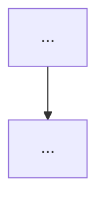

# SR Split Ready

## Goal

Prepare an existing review report, architecture audit, RFC, implementation plan, or large draft so `sr-plan-split` can split it into executable task files.

This skill checks whether the artifact has enough task-splitting structure:

- baseline metadata
- P0/P1 evidence anchors
- acceptance criteria
- source coverage completeness (every finding has a disposition)
- dependency ordering
- validation-first classification
- existing planning/backlog deduplication
- split scope

It produces a verdict and, when needed, a companion document. It does not produce task files.

## Core Rule

**This skill is a split linter and adapter, not a reviewer.**

Do not re-review the artifact's conclusions, re-rank severity, or re-litigate whether every finding is true.

Allowed source inspection is narrow:

- Inspect the current working tree only to attach or refresh evidence anchors for P0/P1 findings.
- Do not perform full-source revalidation.
- Do not expand the review scope.
- Do not turn medium-confidence or suspected items into confirmed repair tasks.

If deeper correctness checking is needed, send the artifact back to `sr-review`.

## Trigger Rules

Use this skill when the user asks for any of:

- `sr-split-ready`
- `split-ready`
- `拆任务前预处理`
- `整理成可拆任务输入`
- `准备 sr-plan-split`
- `这份报告能不能拆任务`
- turning a report, review, RFC, or draft into an input for `sr-plan-split`

Do not use this skill for:

- ordinary small code changes
- direct task execution
- simple TODO lists that are already actionable
- second-pass technical review of the artifact's correctness

## Relationship To Other SR Skills

- `sr-review` scrutinizes or improves the artifact's conclusions.
- `sr-split-ready` checks whether an existing artifact is structurally ready to split.
- `sr-plan-split` creates execution-ready task markdown files.
- `sr-task-runner` executes those task files in dependency order.

Long term, high-risk `sr-review` outputs should ideally include split-ready fields. This skill mainly adapts external reports, legacy drafts, and review artifacts that were not produced in that shape.

## Output Contract

Always start with a verdict:

- `READY`
- `NOT-READY`

Then provide the canonical checklist.

Status values are fixed:

- `ready`: the check is satisfied.
- `partial`: some required fields are present but incomplete.
- `missing`: the check is required or triggered but absent.
- `not-needed`: the conditional check was not triggered for this artifact.

Verdict rule:

`NOT-READY` if any required check is `missing` or `partial`, or if any triggered conditional check is `missing` or `partial`.

`READY` only when all required checks are `ready` and every conditional check is either `ready` or `not-needed`.

Coverage override: if any source finding/theme has no disposition in the Source Coverage Map, the verdict is `NOT-READY` regardless of how complete the P0/P1 fields are. Lossless coverage means every source item has a recorded destination, not that every detail is copied into the companion.

Example:

```markdown
## Verdict

NOT-READY

| Check | Status | Notes |
|---|---|---|
| Baseline metadata | missing | no commit SHA or worktree status |
| P0/P1 evidence anchors | partial | 3 findings lack current working-tree file lines |
| Acceptance criteria | ready | P0/P1 items have criteria |
| Source coverage map | partial | C-4..C-7 have no disposition |
| Dependency graph | missing | required because tasks are serial |
| Planning dedup | ready | docs/planning overlaps were classified |
| Validation-first items | not-needed | no medium-confidence items in split scope |
| Split scope | ready | first wave is P0/P1 only |
```

For `NOT-READY`, include a short `Must Fix Before sr-plan-split` list.

For `READY`, identify the companion document path or proposed path.

## Default Artifact Policy

Do not modify the original review/report by default.

The original artifact is a provenance snapshot. Preserve it.

Default companion path:

```text
<original-name>-split-ready.md
```

Only add a pointer to the original artifact if the user explicitly asks to edit the original.

## Process

Use this order:

1. Read the artifact and extract the intended split scope, P0/P1 findings, high-impact equivalents, and medium-confidence or owner-confirmation items.
2. Record the baseline with `git rev-parse --short HEAD`, branch, and worktree status. If the worktree is dirty, evidence anchors are still taken from the current working tree and the dirty state must be recorded.
3. Re-open the current working tree only for P0/P1 findings that are in the split scope, and attach fresh evidence anchors plus lightweight verification commands.
4. Detect existing planning or backlog sources such as `docs/planning/`, prior split outputs, or roadmap docs, and decide whether Planning Dedup is triggered.
5. Build the Source Coverage Map: assign every source finding/theme a disposition, and confirm no item is left unassigned.
6. Classify validation-first items, dependency edges, and acceptance criteria gaps.
7. Apply the verdict rule, then write or propose the companion document.

## Required Checks

These are mandatory for non-trivial split input. Missing or partial required checks produce `NOT-READY`.

### 1. Baseline Metadata

The companion document must include:

- source artifact path
- reviewed commit SHA
- branch
- worktree status
- prepared timestamp
- key statistics and the commands used to compute them, when the artifact relies on counts

Example:

```markdown
## Review Baseline

- Source: `docs/architecture-review-2026-05.md`
- Commit: `abc1234`
- Branch: `master`
- Worktree: clean
- Prepared at: `2026-05-30`
- Statistics:
  - `grep -ci "CREATE TABLE" deploy/mysql/schema.sql`
```

### 2. P0/P1 Evidence Table

For every P0/P1 item that will be split, include:

- finding id
- claim
- severity
- current working-tree evidence anchor
- reproduction or verification command
- owner, if known
- acceptance criteria

If the artifact has no P0/P1 severity labels, first triage the findings into equivalent split buckets:

- blocking or irreversible risk equals P0/P1 for this check.
- high-impact correctness, safety, security, financial, or rollout risk equals P0/P1 for this check.

Anchor the consolidated P0/P1 roadmap items, not every repeated sub-finding that merely points back to the same item.

Low-priority findings do not need a full evidence row here, but they still must appear in the Source Coverage Map below. "Not in the evidence table" must never mean "dropped".

When adding evidence anchors, re-open the current working tree. Do not copy stale line numbers from report prose.

### 3. Acceptance Criteria

Every item eligible for split must have a concrete completion condition.

If any item in the split scope lacks a concrete completion condition, Acceptance Criteria is `partial`.

Bad:

```markdown
Improve observability.
```

Good:

```markdown
Gift reconcile job exposes run count, error count, duration histogram, and processed row count; metrics are covered by unit tests or startup registration checks.
```

### 4. Source Coverage Map

Enumerate every finding/theme in the source artifact and give each a disposition:

- `first-wave` — splits into a first-wave task
- `validation-first` — splits as a validation task before any repair
- `split-across` — one finding feeds multiple tasks (e.g. a first-wave fix plus a later metrics/CI task); name a primary target and every secondary target in the Target column
- `backlog` — deferred; record the deferral reason
- `covered-by-existing-work` — already implemented or tested in the current tree; cite the concrete evidence (file/test). A plan or intention is not coverage and may not use this disposition. Claiming `tested` requires either a verification command or an explicit note that validation was not run; if it was not verified, the item is `partial` unless the implementation evidence alone (not the test) is sufficient to call it covered.
- `dedup-to-existing-plan` — covered by an existing planning/backlog/roadmap doc but not yet implemented; must link a Planning Dedup row and state `reuse` or `extend`
- `merged-into` — folded into another task or backlog bucket; name the target in the Target column
- `out-of-scope` — explicitly excluded; record why

Rules:

- Source id enumeration: if the source has numbered findings (e.g. `C-1`, `D-2`), every numbered id must appear exactly once in the Coverage Map by its own id. Only when the source has no numbering may you derive stable source ids from headings/bullets. A broad theme may not stand in for individually numbered sub-findings.
- One primary disposition per source item, but a finding may carry secondary preservation targets via `split-across`. When a finding splits, every secondary acceptance condition must land on a named secondary target, not be dropped into the primary.
- Use consolidated findings, not every repeated sub-line. But a consolidated item must not silently absorb a distinct sub-finding that carries its own boundary condition, exception, or acceptance requirement.
- For `merged-into`, `backlog`, and `split-across` secondary targets, preserve the source item's load-bearing detail (boundary conditions, exception handling, verification requirement, operational constraint). A bare generalized title is `partial`, not `ready`.
- This check is `missing` if any source finding (or numbered id) has no disposition, and `partial` if a disposition exists but a `merged-into`/`backlog`/`split-across` item lost its load-bearing detail, a `dedup-to-existing-plan` item has no linked Planning Dedup row, or `covered-by-existing-work` claims test coverage without a verification command or an explicit note that validation was not run.
- Coverage Map and Validation-First Items must be bidirectionally consistent: every Coverage Map row with disposition `validation-first` must appear in the Validation-First Items table, and every Validation-First Items row must appear in the Coverage Map as `validation-first`. Any mismatch makes Source Coverage Map and Validation-First Items `partial`.

This is what makes coverage lossless: the companion may be much shorter than the source, but nothing leaves the source without a recorded destination.

Example:

```markdown
| Source item | Disposition | Target | Detail preserved |
|---|---|---|---|
| C-1 Actor run() no recover | first-wave | Task 03 | panic containment + acceptance |
| C-2 ticker recover + metrics | split-across | primary: Task 03; secondary: Task 07 metrics | recover in 03; run/error metrics acceptance in 07 |
| C-3 Close() not joining doneCh | backlog | Backlog B2 | lease-release vs TTL-takeover note kept |
| C-5 Version bump invariant | covered-by-existing-work | room_state_mutation_invariants_test.go | monotonic Version test cited |
| C-6 ctx-cancel result mismatch | dedup-to-existing-plan | docs/planning/x.md (extend) | ctx cancellation semantics kept |
| C-7 time.Local in ServiceContext | backlog | Backlog B4 | move init to main; runtime risk noted |
```

## Conditional Checks

Use these only when triggered. Do not force ceremony on small inputs.

### Dependency Graph

Required when:

- more than one task will be produced
- tasks have serial order
- validation or tooling affects later task confidence
- rollout order matters

Important rule:

**Validation credibility prerequisite is not the same as execution blocker.**

For example, CI may be a prerequisite for reliable automated validation, but it must not mechanically block urgent P0 safety or financial-loss mitigation that can proceed in parallel.

### Planning Dedup

Required when the repo contains existing planning, backlog, or task docs such as:

- `docs/planning/`
- existing task directories
- roadmap docs
- prior split outputs

Classify each overlap:

- `reuse existing plan`
- `extend existing plan`
- `conflicts, needs decision`
- `new task`

Do not create duplicate task streams.

Every `dedup-to-existing-plan` item in the Source Coverage Map must have a matching row here with `reuse` or `extend`. If the overlap is `conflicts, needs decision`, the source item is not yet covered and must not use `dedup-to-existing-plan`.

### Validation-First Items

Required when the source artifact marks items as:

- medium confidence
- needs owner confirmation
- requires further investigation
- suspected but not proven
- depends on unstated operational assumptions

These must split as validation tasks, not direct repair tasks.

The Validation-First Items table must exactly match the Coverage Map's `validation-first` disposition set. Do not hide validation-first work only in Split Scope, Planning Dedup, or backlog prose.

Acceptance shape:

```markdown
Produce a confirmed true/false conclusion with evidence. If true, propose a repair plan and acceptance criteria.
```

### Split Scope

Required when the source contains P2/P3/backlog items.

Define the first split wave, usually:

- P0
- P1
- validation-first items needed before repair

Move lower-priority cleanup into backlog unless the user explicitly asks to split everything.

The Source Coverage Map remains the authority. Split Scope is only a grouped view of the map, not a second source of truth; if they conflict, the Coverage Map wins and the Split Scope is `partial` until reconciled.

## Companion Document Shape

Use this shape by default:

````markdown
# Split Ready - <artifact title>

## Verdict

READY / NOT-READY

## Checklist

| Check | Status | Notes |
|---|---|---|
| Baseline metadata | ready/partial/missing | ... |
| P0/P1 evidence anchors | ready/partial/missing | ... |
| Acceptance criteria | ready/partial/missing | ... |
| Source coverage map | ready/partial/missing | ... |
| Dependency graph | ready/partial/missing/not-needed | ... |
| Planning dedup | ready/partial/missing/not-needed | ... |
| Validation-first items | ready/partial/missing/not-needed | ... |
| Split scope | ready/partial/missing/not-needed | ... |

## Must Fix Before sr-plan-split

- ...

## Review Baseline

- Source:
- Commit:
- Branch:
- Worktree:
- Prepared at:
- Verification commands:

## Source Coverage Map

| Source item | Disposition | Target | Detail preserved |
|---|---|---|---|

## P0/P1 Evidence Table

| ID | Severity | Claim | Working-tree evidence | Verification | Acceptance criteria |
|---|---|---|---|---|---|

## Validation-First Items

| ID | Why validation-first | Required output |
|---|---|---|

## Dependency Graph



## Planning Dedup

| Finding/theme | Existing plan | Decision |
|---|---|---|

## Split Scope

Source Coverage Map is authoritative; this section is only a grouped view.

### First Wave

- ...

### Backlog

- ...
````

## Final Recommendation

If verdict is `READY`, say it is ready for `sr-plan-split`.

If verdict is `NOT-READY`, do not run `sr-plan-split`; list the minimal missing fields needed to become ready.

Keep the output practical and short. The goal is to prevent bad task splitting, not to produce another large report. Short means compressed expression, not reduced coverage: the Source Coverage Map must still account for every source item even when the companion is far shorter than the original.

## Skill Maintenance

When editing this skill, follow `~/.codex/skills/SR-SKILLS-SYNC.md`: Codex is the canonical source — change it there first, then mirror to `~/.claude/` with the mappings in that file, and keep repo-specific names out of this global skill.
